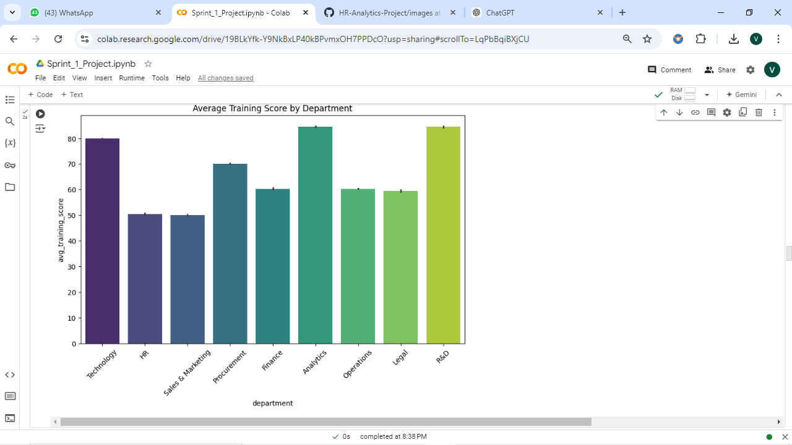
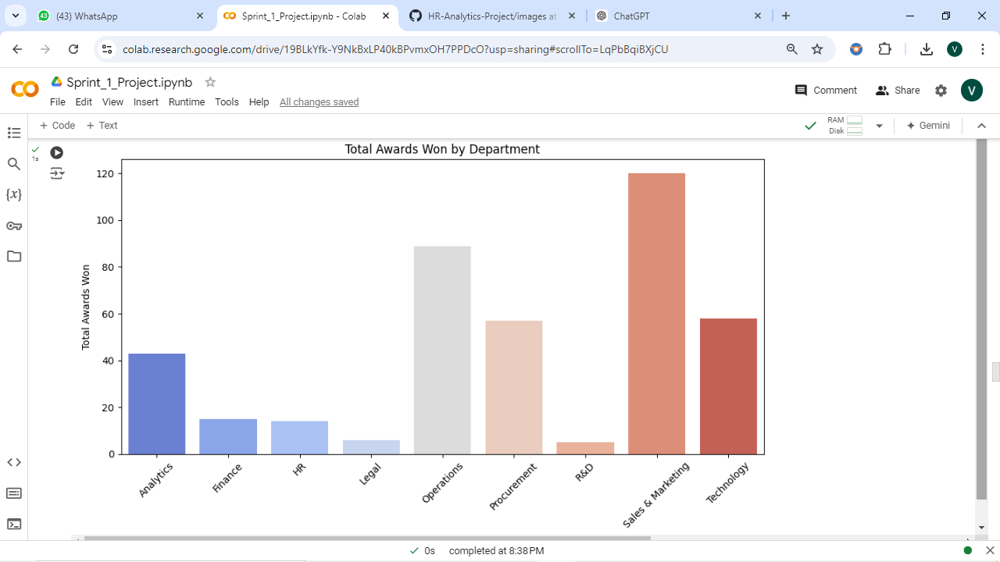
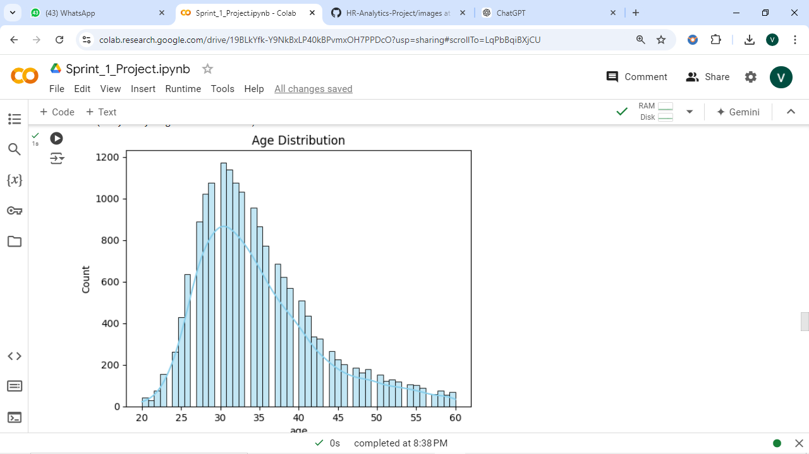
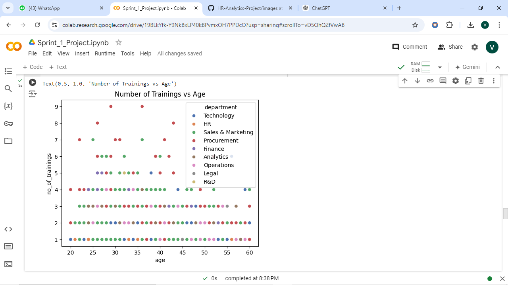
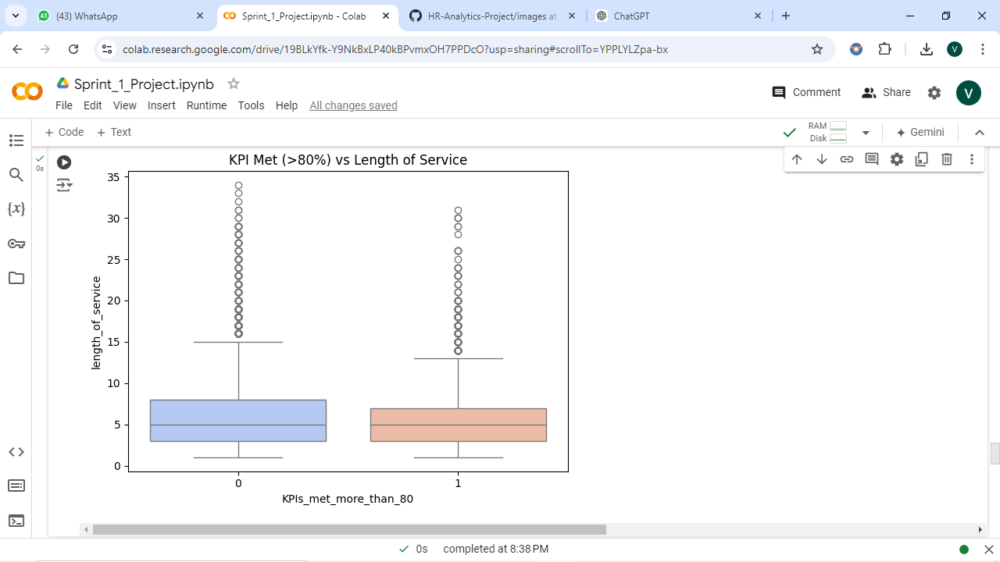
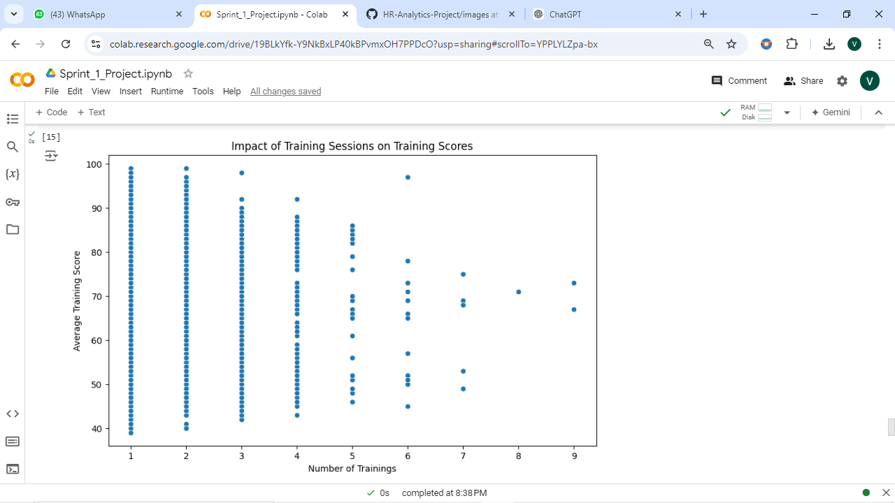

# HR Analytics Project

## Objective

The objective of this project is to analyze a dataset containing employee information from various departments within an organization. The dataset encompasses key attributes such as:

- Employee ID
- Department
- Education level
- Gender
- Recruitment channel
- Training participation
- Performance ratings
- Length of service
- Key performance indicators (KPIs)
- Awards won
- Average training scores

By cleaning and analyzing this dataset, the project aims to:

1. **Identify Patterns**: Discover patterns in employee performance and training effectiveness across different departments.
2. **Assess Training Impact**: Evaluate the relationship between the number of training sessions attended and the average training scores achieved by employees.
3. **Recognize High Performers**: Determine which departments have the highest average training scores and the most awards won, thereby identifying high-performing sectors within the organization.
4. **Inform HR Decisions**: Provide insights that can help human resource management improve training programs and enhance employee performance.

Through this analysis, we generate actionable insights that contribute to strategic HR decisions, fostering a culture of continuous improvement within the organization.

## Data Analysis and Visualizations

To achieve these objectives, the following analyses and visualizations have been conducted:

1. **Average Training Score by Department**:
   - Visualizes the average training score for employees across different departments to identify which departments excel in training programs.
   - 

2. **Total Awards Won by Department**:
   - Displays the total number of awards won in each department, showcasing high-performing areas within the organization.
   - 

3. **Age Distribution**:
   - Illustrates the distribution of employee ages across the organization to understand the demographic spread.
   - 

4. **Number of Trainings vs. Age**:
   - Shows the relationship between the number of trainings attended and the age of employees.
   - 

5. **KPI Met (>80%) vs. Length of Service**:
   - Analyzes how long employees have been with the organization relative to their performance measured by KPIs.
   - 

6. **Assess the Impact of Training Sessions on Performance**:
   - Examines the correlation between the number of training sessions attended and performance scores, identifying the effectiveness of training programs.
   - 
## Tools and Technologies Used

- **Data Analysis**: Python (Pandas, NumPy)
- **Data Visualization**: Matplotlib, Seaborn
- **IDE**: Jupyter Notebook
- **Data Cleaning**: Python libraries for preprocessing

## How to Run the Project

1. Clone the repository: 
   ```
   git clone https://github.com/yourusername/hr-analytics-project.git
   ```
2. Install the required packages:
   ```
   pip install -r requirements.txt
   ```
3. Run the Jupyter Notebook:
   ```
   jupyter notebook HR_Analytics.ipynb
   ```

## Conclusion

This project provides valuable insights into employee performance, training effectiveness, and department-wise achievements. The outcomes can guide HR in refining training programs and boosting employee satisfaction and retention
